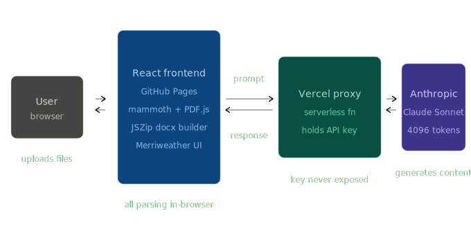

# EasyJob

AI-powered career toolkit — resume grading, company research, and interview prep in one tool.

**Live demo:** [hebronabel1.github.io/easyjob](https://hebronabel1.github.io/easyjob/)

---

## What it does

EasyJob gives job seekers three AI-powered tools in one place:

- **Resume** — upload a .docx or .pdf resume, paste a job description, and choose to Grade, Tailor, Template, or generate a Cover Letter. All selected functions run in sequence and results appear in tabs. Downloads as a properly formatted ATS-friendly .docx.
- **Company Research** — type any company name and get a 10-topic deep dive covering founding, services, growth, clients, current projects, news, milestones, future plans, culture, and leadership. Includes a typo detection step before running.
- **Interview Prep** — paste a JD, set how many questions to prep for and how many to ask, enter a salary goal, and get a full guide including prep questions with suggested answers, questions to ask the interviewer, and objection handling scripts.

---

## Architecture


```
┌──────────────┐        ┌────────────────────┐        ┌─────────────────┐        ┌──────────────────┐
│     User     │◀──────▶│   React Frontend   │◀──────▶│  Vercel Proxy   │◀──────▶│  Anthropic API   │
│   browser    │        │   GitHub Pages     │        │  Serverless fn  │        │  Claude Sonnet   │
└──────────────┘        │                    │        │  quizmind-api   │        │  4096 max tokens │
                        │  mammoth (docx)    │        └─────────────────┘        └──────────────────┘
                        │  PDF.js (pdf)      │
                        │  JSZip (docx out)  │
                        │  Merriweather UI   │
                        └────────────────────┘
```

The frontend handles all file parsing locally in the browser. No resume data is sent to a server — only the extracted text is included in the AI prompt. The Vercel proxy holds the Anthropic API key so it is never exposed in client-side code.

---

## Screen flow


```
Password gate
     │
     ▼
 Main menu
 ┌───┴──────────────────┐
 │                      │                      │
 ▼                      ▼                      ▼
Resume               Company Research      Interview Prep
 │                      │                      │
 ├─ Select type         ├─ Input + scope        ├─ Paste JD
 ├─ Paste JD            ├─ Typo check           ├─ Company, role
 ├─ Upload resume       └─ Results + .docx      ├─ Question dropdowns
 ├─ 2x2 action grid                             ├─ Salary goal
 └─ Tabbed results                              └─ Guide + .docx
      + preview modal
      + download .docx
```

---

## Tech stack

| Layer | Technology |
|---|---|
| Frontend | React (single component), Vite |
| File parsing | mammoth (.docx), PDF.js (.pdf) |
| Document generation | JSZip — real Open XML .docx format |
| AI engine | Claude Sonnet via Anthropic API |
| Backend proxy | Vercel Serverless Functions |
| Hosting | GitHub Pages |
| Font | Merriweather (Google Fonts) |

---

## Resume output format

Downloaded resumes follow a strict ATS-friendly format matching standard professional templates:

- **Name** — centered, bold, uppercase, 14pt
- **Contact line** — centered, 10pt
- **Section headers** — uppercase, bold, 10.5pt, with a solid bottom border line (PROFESSIONAL SUMMARY, EDUCATION, WORK EXPERIENCE, SKILLS ACTIVITIES & INTERESTS)
- **Body** — Times New Roman 11pt, single-spaced
- **Bullets** — X-Y-Z formula (Accomplished X as measured by Y by doing Z)
- **Margins** — 0.65in top/bottom, 0.75in left/right
- **Target** — fits on one page

---

## Key features

- Password gate
- Dark / light mode toggle
- Cancel button on all loading screens
- Back and Home navigation on every screen
- Salary field auto-formats as you type ($65,000)
- Company typo detection before running research
- Preview modal shows document exactly as it will appear in Word
- Real .docx files via JSZip Open XML — no Word recovery errors

---

## Project structure

```
easyjob/
├── src/
│   └── App.jsx          # Entire application (single component)
├── vite.config.js       # base: '/easyjob/' for GitHub Pages
└── package.json

quizmind-api/            # Separate private repo
├── api/
│   └── chat.js          # Vercel serverless function (API proxy)
└── package.json
```

---

Built by Hebron Abel — DePaul University
